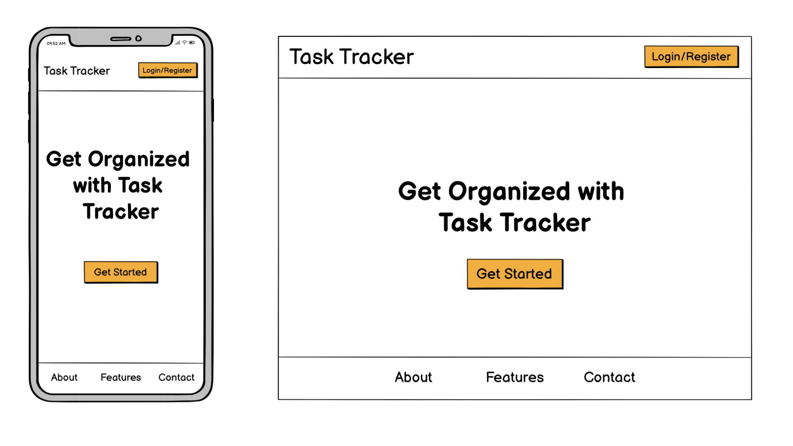
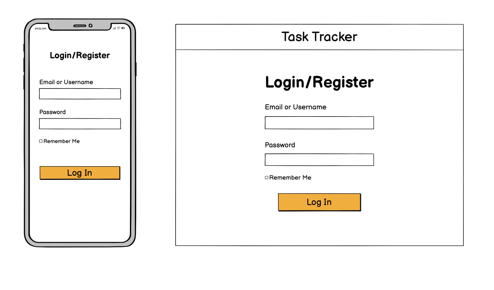
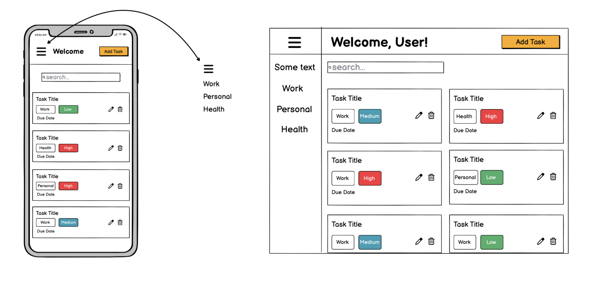

# 📋 Task Tracker - Professional Task Management System

	⁠A modern, responsive task management application built with Django that helps users organize, prioritize, and track their daily tasks with an intuitive and beautiful interface.

---

## 📱 Responsive Screenshots

| Mobile | Tablet | Desktop |
|--------|--------|---------|
|  |  |  |

---

## What This Project Does

*Task Tracker* is a comprehensive task management solution designed to help users stay organized and productive. The application provides an intuitive interface for creating, managing, and tracking tasks across different devices with a mobile-first approach.

### Key Benefits for Users:
•⁠  ⁠*📱 Mobile-First Design*: Seamless experience across all devices
•⁠  ⁠*⚡ Real-Time Updates*: Instant task status changes with smooth animations
•⁠  ⁠*🎨 Beautiful Interface*: Modern, clean design that's pleasant to use
•⁠  ⁠*📊 Task Analytics*: Visual statistics and progress tracking
•⁠  ⁠*🔐 Secure Authentication*: Personal task management with user accounts
•⁠  ⁠*✅ Smart Organization*: Priority-based task sorting and categorization

---

## 🎨 Design Philosophy & Color Choices

### Primary Color Palette

| Color | Hex Code | Usage | Psychology |
|-------|----------|-------|------------|
|  *Warm Yellow* | ⁠ #ffc107 ⁠ | Primary actions, highlights | Optimism, energy, productivity |
|  *Charcoal* | ⁠ #333333 ⁠ | Text, headers | Professionalism, readability |
|  *Light Gray* | ⁠ #f8f9fa ⁠ | Backgrounds | Clean, minimal, focus |
|  *Blue* | ⁠ #007bff ⁠ | Links, secondary actions | Trust, reliability |

### Why These Colors?

*🟡 Warm Yellow (#ffc107)* - The cornerstone of our design
•⁠  ⁠*Psychological Impact*: Yellow stimulates mental activity and generates positive energy
•⁠  ⁠*Productivity Focus*: Associated with clarity, optimism, and enhanced focus
•⁠  ⁠*Accessibility*: High contrast against dark text, ensuring readability
•⁠  ⁠*Brand Differentiation*: Stands out from typical blue/green productivity apps

*⚫ Charcoal (#333333)* - Professional and readable
•⁠  ⁠*Readability*: Softer than pure black, reducing eye strain
•⁠  ⁠*Professional Appeal*: Conveys seriousness and reliability
•⁠  ⁠*Modern Aesthetic*: Contemporary alternative to harsh black text

The color combination creates a *warm yet professional* atmosphere that encourages productivity while maintaining visual comfort during extended use.

---

## 📐 Wireframes & Design Evolution

### Initial Wireframes

| Home Page | Authentication | Dashboard | Task Creation |
|-----------|----------------|-----------|---------------|
|  |  |  |  |

### Design Progression
1.⁠ ⁠*📋 Initial Concept*: Simple task list with basic CRUD operations
2.⁠ ⁠*🎨 Visual Enhancement*: Introduction of yellow branding and modern UI
3.⁠ ⁠*📱 Mobile Optimization*: Mobile-first approach with responsive breakpoints
4.⁠ ⁠*⚡ Interactive Elements*: Smooth animations and real-time updates
5.⁠ ⁠*📊 Analytics Integration*: Task statistics and progress visualization

---

## 🚀 Core Functionality

### For End Users

#### 🔐 *Authentication System*
•⁠  ⁠*User Registration*: Secure account creation with validation
•⁠  ⁠*Login/Logout*: Session management with "Remember Me" functionality
•⁠  ⁠*Profile Management*: User information and preferences

#### 📋 *Task Management*
•⁠  ⁠*Create Tasks*: Add tasks with title, description, priority, and due dates
•⁠  ⁠*Edit Tasks*: Modify existing tasks without losing data
•⁠  ⁠*Delete Tasks*: Remove completed or unnecessary tasks
•⁠  ⁠*Priority System*: High, Medium, Low priority with color coding
•⁠  ⁠*Real-Time Updates*: Instant status changes with smooth animations

#### ✅ *Task Completion System*
•⁠  ⁠*Checkbox Interaction*: Click to mark tasks as complete/incomplete
•⁠  ⁠*Visual Feedback*: Smooth animations and notifications
•⁠  ⁠*Automatic Sorting*: Completed tasks move to dedicated section
•⁠  ⁠*Bulk Operations*: Clear all completed tasks with confirmation

#### 📊 *Dashboard Analytics*
•⁠  ⁠*Task Statistics*: Real-time counts of total, pending, and completed tasks
•⁠  ⁠*Progress Visualization*: Visual representation of task completion
•⁠  ⁠*Quick Actions*: Fast access to common operations

#### 📱 *Responsive Design*
•⁠  ⁠*Mobile Navigation*: Hamburger menu with slide-out sidebar
•⁠  ⁠*Touch-Friendly*: Optimized for touch interactions
•⁠  ⁠*Cross-Device Sync*: Consistent experience across all devices

---

## 👥 User Stories

### 🎯 Primary User: Busy Professional
	⁠"As a busy professional, I need a simple yet powerful task management system that works seamlessly across my phone, tablet, and desktop so I can stay organized whether I'm in the office, at home, or on the go."

*Acceptance Criteria:*
•⁠  ⁠✅ Can access tasks from any device with consistent interface
•⁠  ⁠✅ Can quickly add tasks during meetings or while mobile
•⁠  ⁠✅ Receives visual feedback when completing tasks
•⁠  ⁠✅ Can prioritize tasks to focus on what's important

### 📚 Secondary User: Student
	⁠"As a student, I want to track my assignments and study tasks with different priority levels so I can manage my workload effectively and never miss important deadlines."

*Acceptance Criteria:*
•⁠  ⁠✅ Can categorize tasks by priority (High, Medium, Low)
•⁠  ⁠✅ Can see at a glance which tasks are most urgent
•⁠  ⁠✅ Can track progress with visual statistics
•⁠  ⁠✅ Can work efficiently on mobile device between classes

### 🏠 Tertiary User: Home Manager
	⁠"As someone managing household tasks, I need a clean, intuitive interface where I can quickly add, complete, and organize daily tasks without complexity getting in the way."

*Acceptance Criteria:*
•⁠  ⁠✅ Simple, clutter-free interface
•⁠  ⁠✅ Quick task creation and completion
•⁠  ⁠✅ Visual satisfaction when completing tasks
•⁠  ⁠✅ Easy to use without technical knowledge

---

## 🛠️ Technology Stack

### Backend

•⁠  ⁠*Django 4.x*: Web framework providing robust backend functionality
•⁠  ⁠*Python 3.x*: Core programming language
•⁠  ⁠*SQLite*: Database for development (PostgreSQL for production)
•⁠  ⁠*Django ORM*: Database abstraction and management

### Frontend

•⁠  ⁠*HTML5*: Semantic markup with accessibility considerations
•⁠  ⁠*CSS3*: Modern styling with Flexbox and Grid layouts
•⁠  ⁠*Vanilla JavaScript*: Dynamic interactions and AJAX functionality
•⁠  ⁠*Responsive Design*: Mobile-first approach with CSS media queries

### Development Tools

### Deployment (Production Ready)

---

## ⚡ Key Features Breakdown

### 🎨 *Frontend Features*
•⁠  ⁠*Mobile-First Responsive Design*
  - Breakpoints: 576px, 768px, 992px, 1200px
  - Flexible grid system
  - Touch-optimized interactions

•⁠  ⁠*Interactive UI Components*
  - Slide-out navigation sidebar
  - Smooth task animations
  - Real-time notifications
  - Loading states and feedback

•⁠  ⁠*Accessibility Features*
  - ARIA labels and semantic HTML
  - Keyboard navigation support
  - High contrast color ratios
  - Screen reader compatibility

### 🔧 *Backend Features*
•⁠  ⁠*Robust Django Architecture*
  - Model-View-Template (MVT) pattern
  - Custom user authentication
  - Form validation and security
  - CSRF protection

•⁠  ⁠*Database Design*
  - User model integration
  - Task model with relationships
  - Efficient queries and indexing
  - Data integrity constraints

•⁠  ⁠*API Endpoints*
  - Task CRUD operations
  - Real-time task updates
  - Bulk operations support
  - Error handling and validation

---

## 📊 Project Management

### 🏗️ Development Methodology
•⁠  ⁠*Agile Development*: Iterative development with regular updates
•⁠  ⁠*Mobile-First Approach*: Starting with mobile design and scaling up
•⁠  ⁠*Progressive Enhancement*: Adding features layer by layer
•⁠  ⁠*User-Centered Design*: Focusing on user experience and feedback

### 📋 Project Tracking

*Sprint Structure:*
1.⁠ ⁠*🏗️ Foundation Sprint*: Basic Django setup and authentication
2.⁠ ⁠*🎨 UI/UX Sprint*: Design implementation and responsive layouts
3.⁠ ⁠*⚡ Functionality Sprint*: Core task management features
4.⁠ ⁠*📱 Mobile Sprint*: Mobile optimization and touch interactions
5.⁠ ⁠*🚀 Polish Sprint*: Animations, notifications, and final testing

---

## 🚀 Getting Started

### Prerequisites
⁠ bash
- Python 3.8+
- Django 4.x
- Git
 ⁠

### Installation

1.⁠ ⁠*Clone the repository*
⁠ bash
git clone https://github.com/yourusername/task-tracker.git
cd task-tracker
 ⁠

2.⁠ ⁠*Create virtual environment*
⁠ bash
python -m venv venv
source venv/bin/activate  # On Windows: venv\Scripts\activate
 ⁠

3.⁠ ⁠*Install dependencies*
⁠ bash
pip install -r requirements.txt
 ⁠

4.⁠ ⁠*Run database migrations*
⁠ bash
python manage.py migrate
 ⁠

5.⁠ ⁠*Create superuser (optional)*
⁠ bash
python manage.py createsuperuser
 ⁠

6.⁠ ⁠*Start development server*
⁠ bash
python manage.py runserver
 ⁠

7.⁠ ⁠*Open in browser*

http://localhost:8000

---

## 🎯 Future Enhancements

### Phase 2 Features
•⁠  ⁠[ ] *Team Collaboration*: Share tasks with team members
•⁠  ⁠[ ] *Task Categories*: Custom categories and tags
•⁠  ⁠[ ] *Due Date Reminders*: Email and push notifications
•⁠  ⁠[ ] *Dark Mode*: Alternative color theme
•⁠  ⁠[ ] *Data Export*: Export tasks to CSV/PDF

### Phase 3 Features
•⁠  ⁠[ ] *Mobile App*: Native iOS/Android applications
•⁠  ⁠[ ] *Calendar Integration*: Sync with Google Calendar
•⁠  ⁠[ ] *Task Templates*: Reusable task templates
•⁠  ⁠[ ] *Analytics Dashboard*: Advanced productivity metrics
•⁠  ⁠[ ] *API Access*: RESTful API for third-party integrations

---

## Contributing

We welcome contributions! Please see our [Contributing Guidelines](CONTRIBUTING.md) for details.

### Development Workflow
1.⁠ ⁠Fork the repository
2.⁠ ⁠Create a feature branch (⁠ git checkout -b feature/amazing-feature ⁠)
3.⁠ ⁠Commit your changes (⁠ git commit -m 'Add some amazing feature' ⁠)
4.⁠ ⁠Push to the branch (⁠ git push origin feature/amazing-feature ⁠)
5.⁠ ⁠Open a Pull Request

---

## 📄 License

This project is licensed under the MIT License - see the [LICENSE](LICENSE) file for details.

---

### 💡 Feature Requests
Have an idea for improvement? I'd love to hear it! Submit your suggestions via GitHub Issues.

---

## 🙏 Acknowledgments

•⁠  ⁠*Design Inspiration*: Modern productivity applications and material design principles
•⁠  ⁠*Community Support*: Django and Python communities for excellent documentation
•⁠  ⁠*Testing*: Beta testers who provided valuable feedback during development
•⁠  ⁠*Icons*: SVG icons from various open-source icon libraries

---

*⭐ Star this repository if you found it helpful!*

